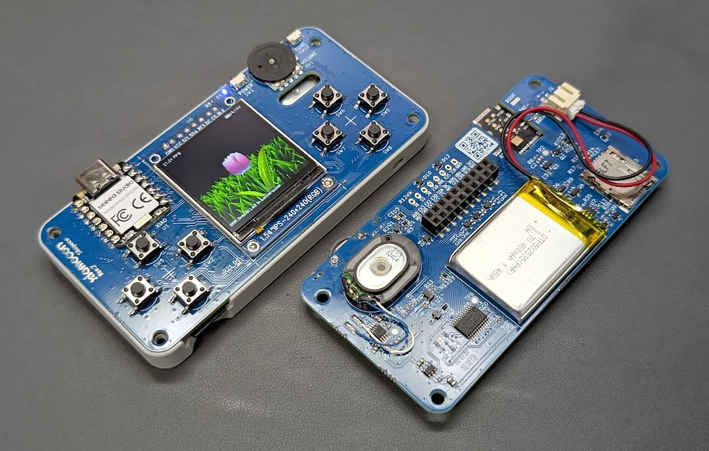
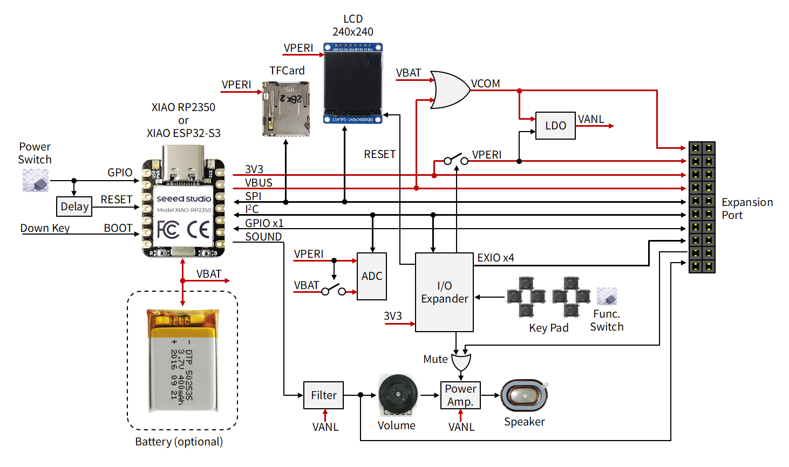
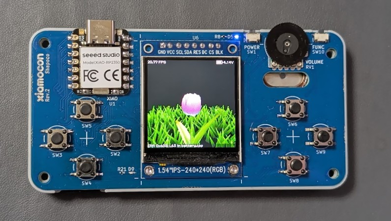
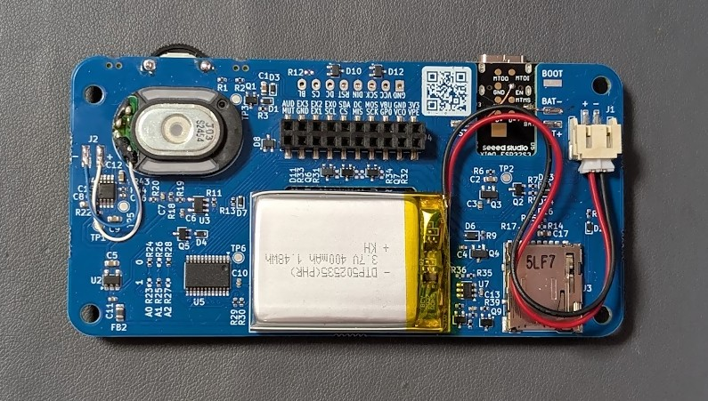
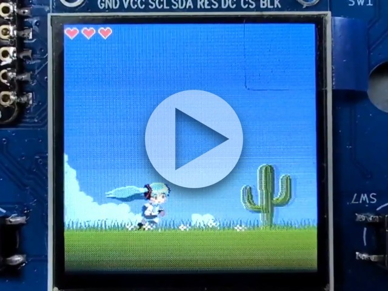
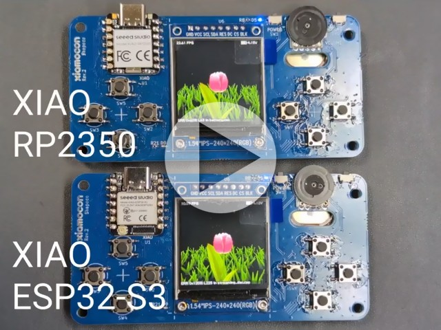

# [WIP] Xiamocon



Game Console-Shaped Motherboard for XIAO RP2350/ESP32S3

> [!CAUTION]
> Everything is under construction. Breaking changes may occur frequently and without notice. 

## Hardware Architecture

[Schematic](https://kicanvas.org/?repo=https%3A%2F%2Fgithub.com%2Fshapoco%2Fxiamocon%2Fblob%2Fmain%2Fhardware%2Fkicad%2Fxiamocon.kicad_sch)



## Setup Development Environment

### for RP2350

1. Install [Pico SDK](https://github.com/raspberrypi/pico-sdk) and set `PICO_SDK_PATH` environment variable.
2. Install [Pico Extras](https://github.com/raspberrypi/pico-extras) and set `PICO_EXTRAS_PATH` environment variable.

### for ESP32S3

Install [PlatformIO](https://docs.platformio.org/).

```bash
curl -fsSL -o get-platformio.py https://raw.githubusercontent.com/platformio/platformio-core-installer/master/get-platformio.py
python3 get-platformio.py
```

### Install Xiamocon SDK

```bash
mkdir -p ${HOME}
cd ${HOME}
git clone https://github.com/shapoco/xiamocon
```

> [!TIP]
> It is recommended to set the `XMC_REPO_PATH` environment variable in `~/.bashrc` or similar.
>
> ```bash
> export XMC_REPO_PATH=${HOME}/xiamocon
> ```

## Creating new project

### for Linux/WSL2

```bash
source ${HOME}/xiamocon/setup.shrc
mkdir -p my_project
cd my_project
xmc init -n my_project
cp -r $XMC_REPO_PATH/cpp/example/hello_world/src .
xmc build
```

## Pictures





## Videos

[](https://x.com/shapoco/status/2031408937321591036)

[](https://x.com/shapoco/status/2038788120653824424)
