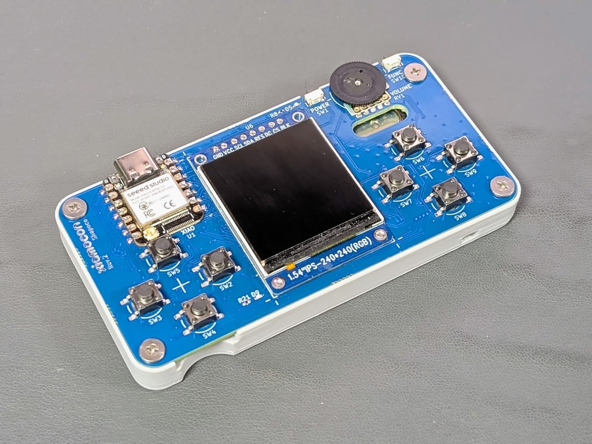
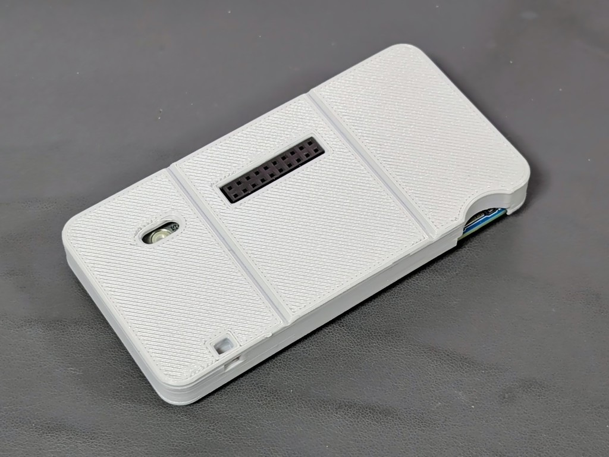
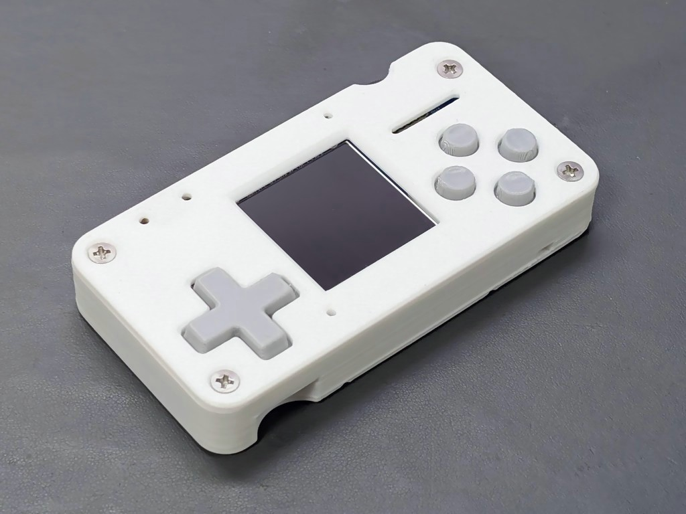
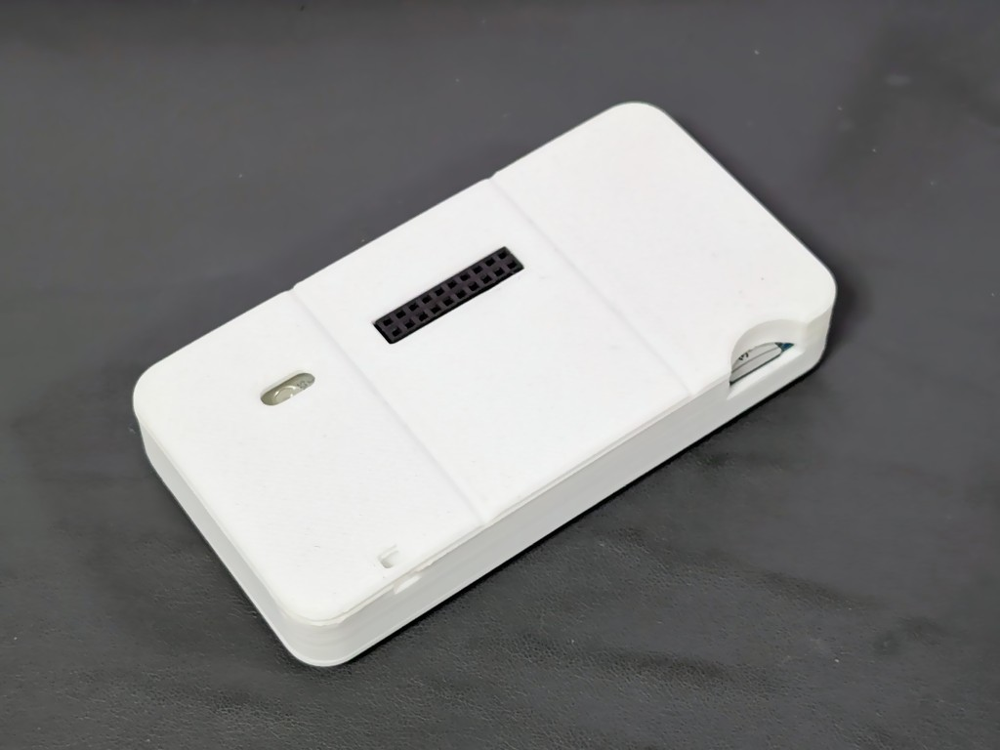
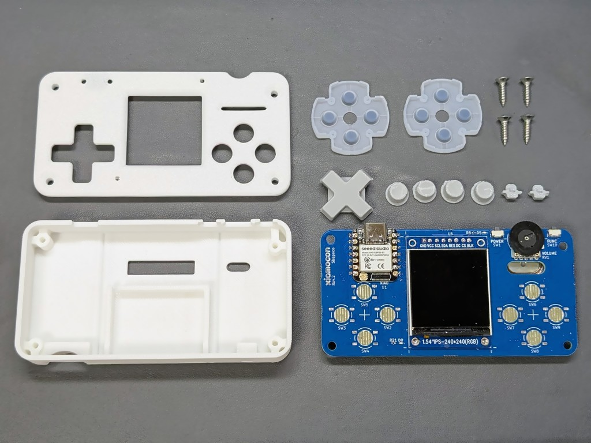
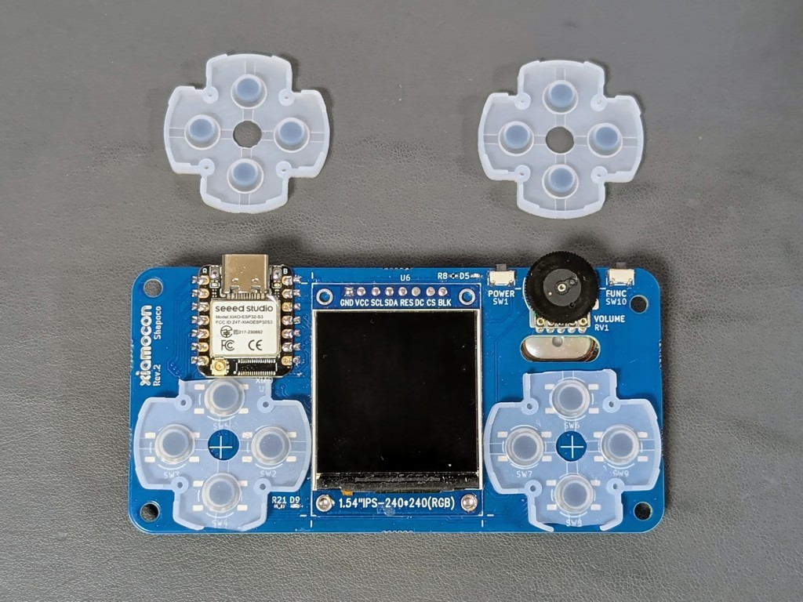
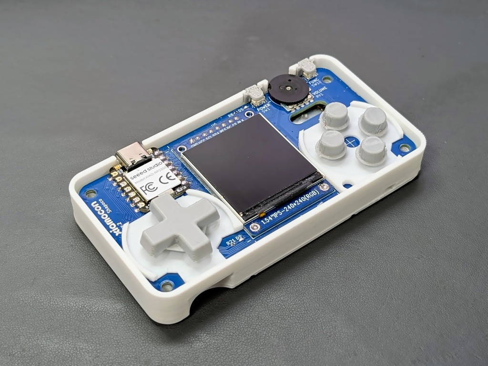

エンクロージャ
################################################################################

簡易版
================================================================================

タクトスイッチを用いる場合の簡易版エンクロージャです。
フロントパネルはありません。

3D データ
--------------------------------------------------------------------------------

- ボディ:

    - `simple.step <https://github.com/shapoco/xiamocon/blob/main/enclosure/simple/simple.step>`__
    - `simple.stl <https://github.com/shapoco/xiamocon/blob/main/enclosure/simple/simple.stl>`__

ネジ止めには 3x8mm の低頭タッピングネジを 4 つ使用します。

バッテリーを内蔵する場合は、中で揺れないようにクッションとしてスポンジなどを入れてください。

フル版
================================================================================

ゲーム機のコントローラの修理用ゴムパッドを使ったエンクロージャです。

3D データ
--------------------------------------------------------------------------------

- ボディ:

    - `full_body.step <https://github.com/shapoco/xiamocon/blob/main/enclosure/full/full_body.step>`__
    - `full_body.stl <https://github.com/shapoco/xiamocon/blob/main/enclosure/full/full_body.stl>`__

- キー:

    - `full_keys.step <https://github.com/shapoco/xiamocon/blob/main/enclosure/full/full_keys.step>`__
    - `full_keys.stl <https://github.com/shapoco/xiamocon/blob/main/enclosure/full/full_keys.stl>`__

組み立て手順
--------------------------------------------------------------------------------

以下のものを用意します。

- Xiamocon 本体
- PS4 / PS5 / スーパーファミコンのコントローラ用ゴムパッド (十字キー側のもの) x2
- 3x12mm 皿頭タッピングネジ x4
- 3D プリント部品
- バッテリー用クッション (必要に応じて)

ゴムパッドは十字キー側のものを 2 つ使用しますので 2 セット調達してください。

キーのモデルは積層痕がボディに引っかからないよう、垂直に立てた状態のモデルデータになっています。
サポートを付けてプリントしてください。

ゲームコントローラの修理用ゴムパッドを、ケース内に収まるようハサミ等でカットします。

バッテリーを内蔵する場合は、中で揺れないようにクッションとしてスポンジなどを入れてください。

バックパネルに Xiamocon 本体を載せ、加工したゴムパッドを配置し、キーを載せます。
電源ボタンとファンクションボタンにもキーをかぶせ、フロントパネルを載せて四隅をネジ止めします。

ネジを強く締めすぎてネジ穴を舐めてしまわないようにご注意ください。

接触が悪くなったときは、接点を鉛筆やシャープペンシルのペンでこすると復活します。
