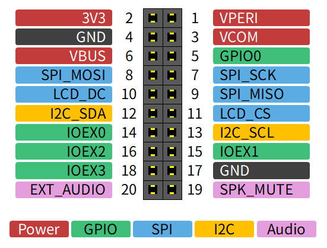

ハードウェア仕様
################################################################################

基本仕様
================================================================================

.. csv-table::
   :header: "項目", "値"

   "基板外形", "100x50mm"
   "MCU ボード", "Seeed Studio XIAO RP2350 または XIAO ESP32S3"
   "ディスプレイ", "1.54インチ 240x240px IPS 液晶 (ST7789)"
   "スピーカー", "ダイナミックスピーカー"
   "キーパッド", "タクトスイッチまたはゴム接点"
   "バッテリー(別売)", "DTP502535 (3.7V 400mAh)"
   "メモリーカード(別売)", "SPIモード専用"
   "拡張ポート", "20pin ピンソケット (I2C、SPI、GPIOx5、オーディオ)"
   "消費電力 (RP2350)", "約 400mW (100mA @ 4V)"
   "消費電力 (ESP32S3)", "約 500mW (120mA @ 4V)"
   "待機電流 (RP2350)", "約 80μA"
   "待機電流 (ESP32S3)", "約 20μA"

回路図
================================================================================

`xiamocon.kicad_sch <https://kicanvas.org/?repo=https%3A%2F%2Fgithub.com%2Fshapoco%2Fxiamocon%2Fblob%2Fmain%2Fhardware%2Fkicad%2Fxiamocon.kicad_sch>`__

電源
================================================================================

VBUS
--------------------------------------------------------------------------------

XIAO から供給される 5V の電源です。
USB ケーブルが接続されていれば XIAO の MCU の状態に関わらず常に供給されます。

VBAT
--------------------------------------------------------------------------------

バッテリーから供給される電源です。
バッテリーが接続されていれば XIAO の MCU の状態に関わらず常に供給されます。

3V3
--------------------------------------------------------------------------------

XIAO に内蔵された DC/DC コンバータによって生成される 3.3V の電源です。
USB ケーブルまたはバッテリーが接続されていれば、XIAO の MCU の状態に関わらず常に供給されます。

VPERI
--------------------------------------------------------------------------------

VPERI はペリフェラルに供給される 3.3V の電源です。
次の条件が両方満たされると供給されます。

- IO エキスパンダの PERI_EN_N が Low であること
- ディスプレイの CS と DC が少なくとも短時間 High であること

ディスプレイの CS と DC が長時間 Low またはハイインピーダンスになると、
PERI_EN_N が Low であっても VPERI の供給は停止します。
これにより XIAO のブートローダーが起動している間はペリフェラルの電源供給が停止します。

VCOM
--------------------------------------------------------------------------------

VCOM は VBUS (5V) と VBAT (バッテリー電圧) のうち高い方が供給されます。
VPERI とは無関係に供給されます。

VANL
--------------------------------------------------------------------------------

VANL はオーディオ回路の供給される 3.3V の電源で、VCOM からシリーズレギュレータによって生成されます。
シリーズレギュレータのイネーブルは VPERI と連動します。

ペリフェラル
================================================================================

電源スイッチ
--------------------------------------------------------------------------------

.. csv-table::
   :header: "信号名", "ピン (RP2350)", "ピン (ESP32S3)"

   "POWER", GPIO 27, GPIO 2

電源スイッチは遅延回路を介して XIAO のリセット端子にも接続されており、
長押しすることによってリセットすることができます。

ディスプレイ
--------------------------------------------------------------------------------

.. csv-table::
   :header: "信号名", "ピン (RP2350)", "ピン (ESP32S3)"

   "SCK", GPIO 2, GPIO 7
   "MOSI", GPIO 3, GPIO 9
   "DC", GPIO 28, GPIO 3
   "CS", GPIO 5, GPIO 4

リセット端子は IO エキスパンダの PORTA の 5 番に接続されています。

ディスプレイの電源は VPERI によって供給されます。

メモリーカード
--------------------------------------------------------------------------------

.. csv-table::
   :header: "信号名", "ピン (RP2350)", "ピン (ESP32S3)"

   "SCK", GPIO 2, GPIO 7
   "MOSI", GPIO 3, GPIO 9
   "MISO", GPIO 4, GPIO 8
   "CS", GPIO 0, GPIO 43

CS ピンを Low にドライブするとアクセスランプが点灯します。

メモリーカードの電源は VPERI によって供給されます。

オーディオ
--------------------------------------------------------------------------------

.. csv-table::
   :header: "信号名", "ピン (RP2350)", "ピン (ESP32S3)"

   "AUDIO_OUT", GPIO 1, GPIO 44

オーディオ出力はバッファ、ローパスフィルタ、ボリュームを介してパワーアンプに接続されます。
XIAO からの出力は PDM または PWM を想定しています。
パワーアンプのミュート端子は IO エキスパンダのポート A の 6 番に接続されています。

GPIO
--------------------------------------------------------------------------------

.. csv-table::
   :header: "信号名", "ピン (RP2350)", "ピン (ESP32S3)"

   "GPIO_0", GPIO 26, GPIO 1

GPIO 端子は拡張ポートに接続されています。

IO エキスパンダ
--------------------------------------------------------------------------------

デバイス: PCA9555

.. csv-table::
   :header: "型番", "デバイスアドレス"

   "PCA9555", "0x22"

.. csv-table::
   :header: "信号名", "ピン (RP2350)", "ピン (ESP32S3)"

   "SDA", GPIO 6, GPIO 5
   "SCL", GPIO 7, GPIO 6

.. csv-table::
   :header: "信号名", "接続先", "極性"

   "PORTA-0", "拡張ポート IOEX0", "ユーザー定義"
   "PORTA-1", "拡張ポート IOEX1", "ユーザー定義"
   "PORTA-2", "拡張ポート IOEX2", "ユーザー定義"
   "PORTA-3", "拡張ポート IOEX3", "ユーザー定義"
   "PORTA-4", "ペリフェラルイネーブル (PERI_EN_N)", "Low アクティブ"
   "PORTA-5", "ディスプレイリセット", "Low アクティブ"
   "PORTA-6", "オーディオミュート", "Low アクティブ"
   "PORTA-7", "ファンクションスイッチ", "Low アクティブ"
   "PORTB-0", "A ボタン", "Low アクティブ"
   "PORTB-1", "B ボタン", "Low アクティブ"
   "PORTB-2", "Y ボタン", "Low アクティブ"
   "PORTB-3", "X ボタン", "Low アクティブ"
   "PORTB-4", "↑ボタン", "Low アクティブ"
   "PORTB-5", "↓ボタン", "Low アクティブ"
   "PORTB-6", "←ボタン", "Low アクティブ"
   "PORTB-7", "→ボタン", "Low アクティブ"

バッテリー監視用 ADC
--------------------------------------------------------------------------------

.. csv-table::
   :header: "型番", "デバイスアドレス"

   "ADC101C027", "0x52"

.. csv-table::
   :header: "信号名", "ピン (RP2350)", "ピン (ESP32S3)"

   "SDA", GPIO 6, GPIO 5
   "SCL", GPIO 7, GPIO 6

ADC の電源は VPERI によって供給されます。

拡張ポート
=================================================================================

拡張ポートは基板の背面にあります。XIAO に近い側が 1 番ピンです。

EXT_AUDIO はオーディオ回路から分岐した信号で、XIAO からのオーディオ出力を外部へ出力したり、
逆に外部からのオーディオ信号を入力して XIAO の出力とミックスしてスピーカーから出力できます。

SPK_MUTE はパワーアンプのミュート端子に接続されており、
High にドライブすることでXiamocon 本体のスピーカーをミュートできます。

GPIO0 と IOEX0-3 の用途はアプリ側で自由に定義できます。